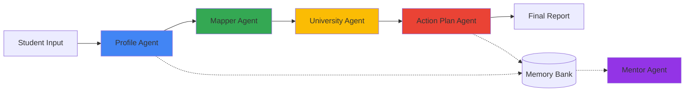

# ascentAI: Intelligent Academic Concierge

A multi-agent academic and university counseling system designed to transform a student's confusion into a clear, actionable plan.

[](https://www.python.org/downloads/)
[](https://github.com/google/adk)
[](https://ai.google.dev/)

## Overview

ascentAI is a personalized, long-term academic and university counselor for high school and undergraduate students. It guides students from uncertainty to clarity, moving them from "I'm uncertain about my future and next steps" to "I know my track, target schools, and prioritized steps for this year."

### The problem: Decision paralysis

Students face critical gaps in academic guidance:

- Lack of structure: overwhelmed by options without a clear, structured planning process
- Limited access: high student-to-counselor ratios prevent sustained, personalized attention
- Actionable gap: difficulty connecting abstract interests to realistic academic tracks and timed application steps

### The solution: Multi-Agent Intelligence

ascentAI delivers 24/7 personalized guidance through a structured, multi-agent pipeline that:

1. Profiles students by extracting interests, grades, and constraints into a standardized format
2. Maps student profiles to 2-3 plausible academic tracks/majors using advanced reasoning
3. Shortlists universities into Reach/Target/Safe tiers based on realistic constraints
4. Generates comprehensive, grade-specific action plans spanning 12-24 months
5. Mentors continuously by following up, tracking progress, and updating roadmaps

## Architecture

### Multi-agent pipeline

ascentAI uses a sequential multi-agent system where data flows through specialized agents:



| Agent | Function | Output |
|-------|----------|--------|
| Profile Agent | Data extraction and standardization | Structured student profile (JSON) |
| Mapper Agent | Interest-to-major mapping | 2-3 academic tracks plus main recommendation |
| University Agent | Constraint-based filtering | Reach/Target/Safe university shortlist |
| Action Plan Agent | Timeline generation | 12-24 month actionable roadmap |
| Mentor Agent | Long-term guidance | Progress-aware mentoring updates |

### Technology stack

- Framework: [Google Agent Development Kit (ADK)](https://github.com/google/adk)
- LLM: Gemini 2.5 Flash Lite for advanced reasoning
- Memory: in-memory session service for persistent student profiles
- Custom tools: university search and memory management utilities

## Getting started

### Prerequisites

- Python 3.11 or higher
- Google API key (Gemini API access)
- Jupyter Notebook environment (for running the demo)

### Installation

1. Clone the repository:
   ```bash
   git clone https://github.com/thecosmos42/ascentAI.git
   cd ascentAI
   ```

2. Install dependencies:
   ```bash
   pip install google-adk google-genai
   ```

3. Set up API credentials.

   For Kaggle notebooks:
   ```python
   from kaggle_secrets import UserSecretsClient
   GOOGLE_API_KEY = UserSecretsClient().get_secret("GOOGLE_API_KEY")
   ```

   For local development:
   ```python
   import os
   os.environ["GOOGLE_API_KEY"] = "your-api-key-here"
   ```

## Usage

### 1. Initial student profiling

Customize the student description with relevant information:

```python
demo_description = """
My name is Dev. I recently completed a Bachelor of Technology (B.Tech) in Computer Science from India.
I love Artificial Intelligence (AI), deep learning, and data science.
My family can afford medium to high tuition, and I'm focused on pursuing a Master's in AI in the Netherlands or Germany.
My scores: Overall GPA 8.5/10.0, with top scores in Algorithms and Linear Algebra.
I have one year of experience as a Data Analyst.
"""
```

### 2. Get progress updates

```python
progress_update = """
Hi, this is Dev again. Since the last plan:
- I built a small ML project and uploaded it on GitHub
- I am doing an internship at an AI startup
What should I focus on next?
"""

mentor_response = await mentor_runner.run_debug(json.dumps({
    "student_id": "student_001",
    "progress_update": progress_update
}))
```

## Customization

### University database

The system uses a customizable university database. To personalize recommendations:

1. Locate the `UNIVERSITY_DB` list in the notebook.
2. Add or modify university entries following this schema:

```python
{
    "name": "University Name",
    "country": "Country",
    "tuition_band": "low|medium|high",
    "has_cs": True,
    "has_ds": True,
    "has_business": False,
    "has_psychology": False,
    "notes": "Additional information"
}
```

## Output format

The system generates a comprehensive Markdown report including:

- Student profile: name, grade, interests, strengths, constraints
- Main track recommendation: chosen academic/career path with justification
- University shortlist: categorized into Reach, Target, and Safe schools
- Action plan timeline:
  - Short-term tasks (0-6 months)
  - Medium-term tasks (6-12 months)
  - Long-term tasks (12-24 months)

## Technical details

### Custom tools

1. `UniversitySearchTool` – filters universities based on profile constraints and chosen track
2. `save_profile_tool` – persists student profiles to memory
3. `get_profile_tool` – retrieves stored student profiles
4. `save_plan_tool` – saves generated action plans
5. `get_plan_tool` – retrieves stored action plans

### Memory management

The system maintains two in-memory databases:

- `STUDENT_MEMORY`: stores structured student profiles
- `PLAN_MEMORY`: stores generated action plans

This enables the Mentor Agent to provide continuous, context-aware guidance across multiple sessions.

## Use cases

- High school students planning undergraduate applications
- Undergraduate students planning graduate school applications
- Career switchers exploring new academic paths
- Academic counselors augmenting human counseling with AI-powered insights

## Acknowledgments

Developed as part of the [AI Agents Course with Google](https://www.kaggle.com/learn-guide/5-day-agents).
